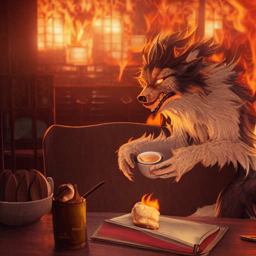
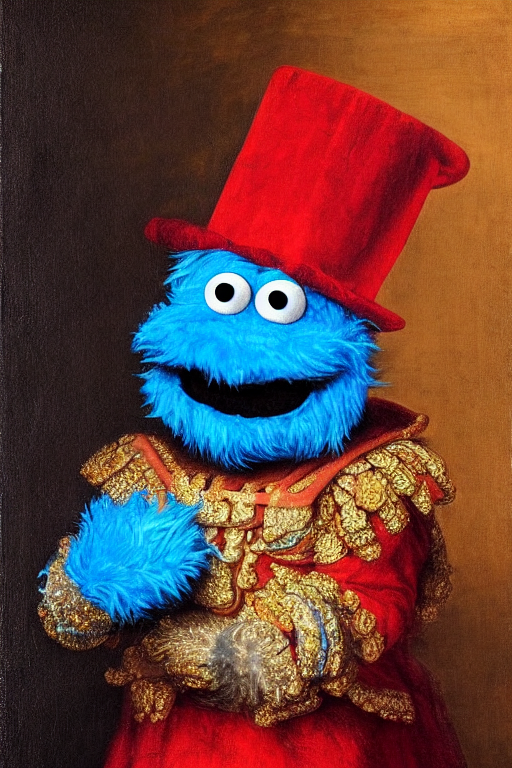
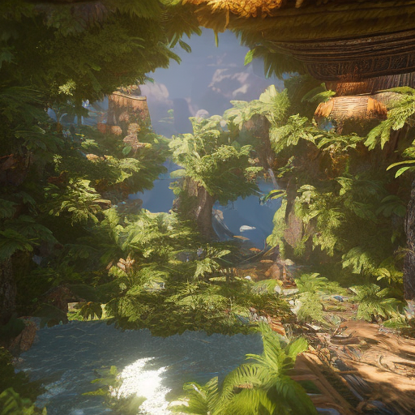
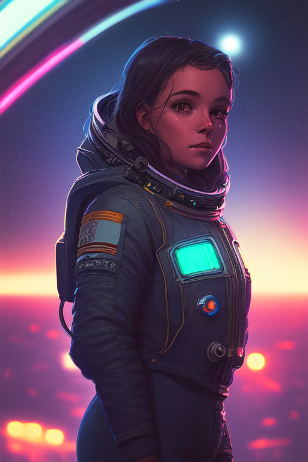
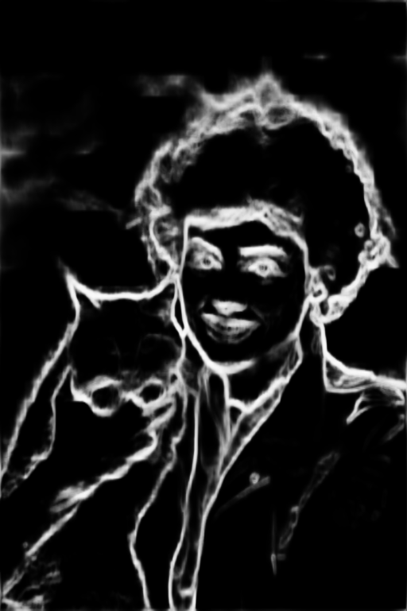

# MetalDiffusion
## Stable Diffusion in TensorFlow / Keras for Apple Metal on Intel Macs

A Keras / Tensorflow implementation of Stable Diffusion, intended for Apple Metal on Intel Macs. This implementation will utilize GPU's on Intel Macs.

The weights were ported from the original implementation of Stable Diffusion.


## Installation

These installation instructions are geared towards use on an Intel Mac.

This program is best utilized within a python virtual environment, making it independent of the python already installed on MacOS.
### Programs required

1) Terminal
2) Homebrew
3) Pyenv
4) Python 3.9
5) Git

`Terminal` will be used for all of the following commands:

### Install Homebrew, if not already installed

`Homebrew` is a fundamental tool for Mac and is required for this installation process.

```bash
/bin/bash -c "$(curl -fsSL https://raw.githubusercontent.com/Homebrew/install/HEAD/install.sh)"
```

### Install/Update pyenv

`pyenv` allows you to install Python independently from the Mac's base installation.

```bash
brew install pyenv
```

If pyenv is already installed, then Homebrew will update pyenv

### Install Python via pyenv

```bash
pyenv install 3.9.0
```

### Set the global Python

Set the global python that the Mac will use to the newly installed, via pyenv, python.

```bash
pyenv global 3.9.0
```

This step will override which version and the location of python the Mac will use, allowing for easier updating and control.

### Install/Update git

`git` allows you to download this repository (repo)

```bash
brew install git
```

If git is already installed, then Homebrew will update git

### Download the github repo

Navigate to a folder/directory you want to create your virtual environment in. For example: `/Users/MacUser`

Download the repo, either by downloading the
[zip](https://github.com/soten355/stable-diffusion-tensorflow-IntelMetal/archive/refs/heads/master.zip)
file or by cloning the repo with git:

```bash
git clone https://github.com/soten355/MetalDiffusion.git
```

### Start working in the virutal environment

First, navigate to the root folder in the github repo that was just installed. For example:

```bash
cd /Users/MacUser/MetalDiffusion/
```

#### Create a virtual environment with *virtualenv*

1) Create your virtual environment for `python`:

    ```bash
    python -m venv venv
    ```
   
2) Activate your virtual environment:

    ```bash
    source venv/bin/activate
    ```
3) Install dependencies using the `requirements.txt` file:

    ```bash
    pip install pip --upgrade --no-cache-dir
    ```

4) Install dependencies using the `requirements.txt` file:

    ```bash
    pip install -r requirements.txt --no-cache-dir
    ```
    
5) When finished using Stable Diffusion, deactivate the virtual environment:
    
    ```bash
    deactivate
    ```

## Usage

### Launching/Starting the program Basics

This program is run through the `dream.py` script, which is a [Gradio Web User Interface](https://gradio.app/). With `Terminal` run this command:

```bash
python dream.py
```

The web UI will automatically load into your default browser.

When you and your computer are finished creating, return to terminal and press `Control C` to end the Gradio web server. Alternatively, you can also quit `Terminal` entirely.

#### Launching/Starting Overrides
By default, the Gradio WebUI will:
* Not create a public link
* Launch the webUI automatically in your default browser

The Gradio defaults can be overridden with command lines. For example:

```bash
python dream.py --share
```
This will launch the webUI and will create a public link through Gradio. This is useful for Google Colab notebooks.

To finish the program, in `Terminal` type `CTRL+C` and the program will quit or quit `Terminal` entirely.

## Legacy vs Contemporary Mode

Stable Diffusion 2.0 (SD) uses two different models than SD 1.4 and 1.5. It's important to select the correct mode when creating with your model(s).

Under *Settings*, select your model. Then select `Use Legacy Stable Diffusion` if you are using any SD models made prior to the release of SD 2.0.

#### Differences between the legacy model and contemporary model

What changed between the two versions of Stable Diffusion were:

**The Text Encoder model**

* SD1.4/1.5 uses OpenAI's CLIP Encoder model
* SD2.x uses the OPENClip Encoder model

**The Unet architecture**
* The Unet is located inside the diffusion model, and what changed was the architecture of the Unet.

## Example outputs 

The following outputs have been generated using this implementation:

1) **Stable Diffusion 1.5**: *A epic and beautiful rococo werewolf drinking coffee, in a burning coffee shop. ultra-detailed. anime, pixiv, uhd 8k cryengine, octane render*




2) ***OpenJourney***: *mdjrny-v4 style, Cookie Monster as a king, portrait, renaissance style, Rembrandt, oil painting, chiaroscuro, highly detailed, textured, king*




3) ***Stable Diffusion 2.1***: *A vision of paradise, Unreal Engine*



4) ***OpenJourney***: Video example:

[Video File](creations/videoExample.mp4)

5) ***DreamShaper*** with <ghst-3000> text embedding: *Grainy portrait of a space traveller, at night in a busy spaceport, highly detailed, cinematic lighting, moody, neon lights, exterior, stars in the sky, ghst-3000*



6) ***ControlNet HED*** with Pre-Processed Example: *tintype photograph of Sigourney Weaver smiling, her hand holding an orange tabby cat, vintage black and white photography, wet plate photography, ambrotype photograph, daguerreotype photo, science fiction, highly detailed, intricate details*




## References

1) https://github.com/CompVis/stable-diffusion
2) https://github.com/geohot/tinygrad/blob/master/examples/stable_diffusion.py
3) https://github.com/divamgupta/stable-diffusion-tensorflow
